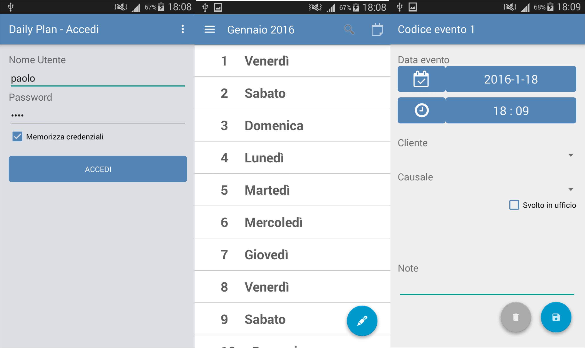

# DailyPlan
A small shared calendar for Android (API >16).

Dailyplan is a small Android application ( about 4kLOC ) designed to simplify mutual information exchange inside a small enterprise.
In a dynamic context where the whole enterprised is formed by autonomous individuals who carry out their respective tasks separately 
it's a key factor the mutual knowledge of everyone's activity.
Looking into this issue derived from a real case we developed DailyPlan both as a university project and as a chance to acquire familiarity
with the Android Framework. So please consider that this is far from a final commercial product and can be instead think of as a starting 
point for a more polished project.

Also please note that this is obviously a demo version, that it not includes any server-side script ( about 400LOC ) nor any database so 
this is not intentionally a working version. If you wish to have one, please contact one of the developers.

Some of the functionality implemented are:

1. Employee login based on credentials (username, password)
2. Month by month event visualization
3. Event search by name
4. Day event visualization
5. Event details visualization
6. Event creation, modification and deletion
7. Client List
8. Proposal creation, modification and deletion

What is the difference between event/proposal?
A proposal is something not definitve and every user can vote once one every single proposal found in the proper section while an
event is certain and usually carried out by one single person (e.g. what about a meeting on wednesday? Proposal. Tomorrow I will restart
XYZ's router? Event.)

This idea can be applied even between families or other non-work groups and maybe further enhanced to include multiple group 
affiliations.

18-01 UPDATE: A demo is available with limited functionality but ultimate layout.
